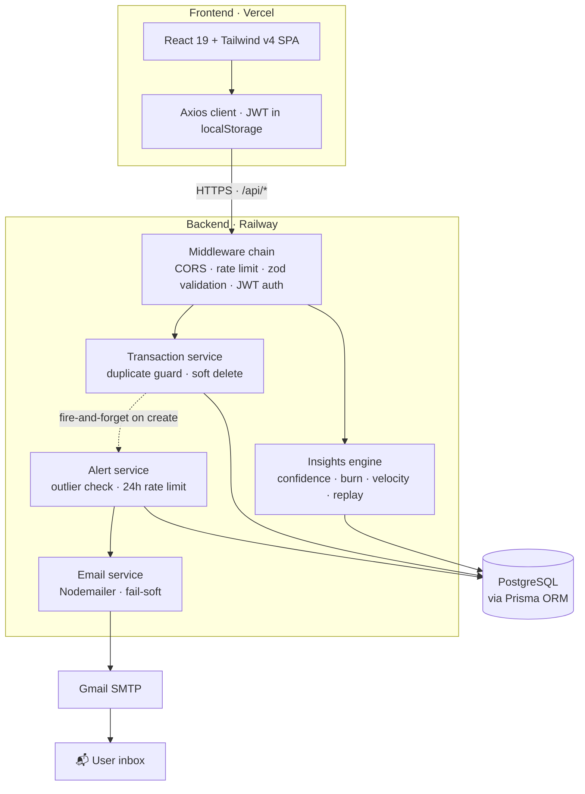

# 💸 Smart Mini-Ledger

**A personal finance ledger that thinks before you save.** Every entry is checked against your own spending history — outliers get flagged, typos get caught, duplicates get questioned, and unusually large expenses land in your inbox.

<p>
  <a href="#-live-demo"></a>
  
  
  
  
</p>

---

## 🔗 Live Demo

| | |
|---|---|
| **App** | https://smart-mini-ledger.vercel.app <!-- update after deploy --> |
| **API health** | https://smart-mini-ledger.up.railway.app/api/health <!-- update after deploy --> |
| **Demo login** | `demo@ledger.app` / `demo1234` — a seeded account with 2 months of data, so every chart is alive the moment you sign in |

---

## ✨ The Twists — Smart Features I Chose to Build

The assignment asked for a simple ledger with an original spin. These are the twists and add-ons I designed on top of the core CRUD — no external AI APIs, no black boxes. All the "intelligence" is **derived statistically from the user's own transaction history**: deterministic, private, free to run, and fast enough to execute on every keystroke.

| Feature | What it does | The logic behind it |
|---|---|---|
| **Confidence Score** | Flags an amount as *unusual* while you're still typing | Compares against your category average; ratio ≥ 3× or ≤ ⅓× → warn |
| **"Did you mean ₹500?"** | Catches extra-zero typos (₹50,000 coffee) | Tests ÷10 / ÷100 / ÷1000 candidates against the category average, suggests the closest |
| **Smart Duplicate Detection** | "Add anyway?" on accidental double-submits | Same amount + type + category within 30 s → 409 with a machine-readable code |
| **Undo everywhere** | 8-second undo on every add & delete | Soft-delete (`isDeleted` flag) + restore endpoint — nothing is destroyed instantly |
| **Cash Burn Meter** | "At ₹740/day, funds last ~34 days" | Month-to-date spend ÷ days elapsed; net of expected income when you set one |
| **Expense Velocity** | "Spending 40% faster than last week" | Rolling 7-day window vs the 7 days before it |
| **Monthly Replay** | A recap card: biggest expense, top category, avg/day | Single-pass aggregation over the month's transactions |
| **Spending DNA** | Donut of your top-5 categories + Other | Client-side category breakdown with a validated categorical palette |
| **Money Calendar** | Heatmap month grid — darker = more spent | Per-day expense totals mapped to a single-hue color ramp |
| **High-Spend Email Alert** | Unusual expense → branded email in your inbox | Reuses the Confidence engine server-side; max 1 email per category per 24 h |

**Why statistics instead of an LLM?** A ledger's intelligence must be *trustworthy, instant, and private*. Statistical rules are explainable ("3× your average"), run in microseconds on every keystroke, cost nothing per request, and never send financial data to a third party. An LLM would be slower, non-deterministic, and overkill for arithmetic.

---

## 🏗 Architecture



Three design decisions worth noting:

1. **The alert decision runs *before* the insert.** The confidence engine averages every row in a category — if the transaction were saved first, a huge outlier would dilute the very baseline it's measured against and partially hide its own spike.
2. **Email is fail-soft by contract.** `sendMail` never throws and delivery is fire-and-forget: a dead SMTP server can never turn a successful save into a 500, and missing credentials just log a skip.
3. **Soft deletes power the UX.** `DELETE` sets a flag instead of removing the row, which is what makes the 8-second Undo toast possible — and safe.

---

## 🛠 Tech Stack & Choices

| Layer | Choice | Why | Considered instead |
|---|---|---|---|
| Frontend | **React 19 + Vite + TypeScript** | Instant HMR, tiny config, first-class TS; SPA is the right shape for a dashboard app | Next.js (SSR unneeded for an auth-gated app), SvelteKit |
| Styling | **Tailwind v4** | Design tokens in CSS (`@theme`), no context switching, dark neon system stays consistent | CSS Modules, styled-components |
| Charts | **Recharts** | Declarative, composable, plays well with React state | Chart.js (imperative), D3 (overkill), visx |
| Backend | **Express 5 + TypeScript** | Minimal surface, async error forwarding built in, everyone can read it | NestJS (heavy for this scope), Fastify (perf we don't need yet), Hono |
| ORM | **Prisma** | Schema-as-source-of-truth, generated types end-to-end, painless migrations | Drizzle (great, less mature migrations), TypeORM, raw SQL |
| Database | **PostgreSQL** | Relational data (users → transactions) with real aggregation (`groupBy`) | MongoDB (wrong shape for ledger math), SQLite (fine locally, weaker hosted story) |
| Validation | **Zod v4** | One schema = runtime validation + inferred TS types; rejects `Infinity`, coerces dates | Joi, Yup, class-validator |
| Auth | **JWT (7d) + bcrypt** | Stateless, works across split deploys without session storage | Cookie sessions (needs shared store), OAuth (overkill for v1) |
| Email | **Nodemailer + Gmail App Password** | Zero-cost, 5-minute setup, fine at personal scale | Resend/SendGrid/SES (the upgrade path if volume grows) |
| Infra | **Railway (API + Postgres) · Vercel (SPA)** | Both deploy from a Git push with per-directory roots on a monorepo | Render, Fly.io, a single VPS |

---

## 📁 Project Structure

```
smart-mini-ledger/
├── backend/
│   ├── prisma/
│   │   ├── schema.prisma          # User · Transaction · AlertLog
│   │   └── migrations/
│   └── src/
│       ├── config/                # typed env loader · Prisma singleton
│       ├── middlewares/           # auth (JWT) · validate (zod) · rate limit · error handler
│       ├── routes/                # auth · transactions · insights
│       ├── controllers/           # thin — parse, delegate, respond
│       ├── services/              # auth · transaction · insights · alert · email
│       ├── validators/            # zod schemas (single source of input truth)
│       └── utils/                 # jwt · password · dates · email templates
├── frontend/
│   └── src/
│       ├── components/            # ui primitives · charts · dashboard cards · layout
│       ├── context/               # AuthContext · ToastContext
│       ├── hooks/                 # useLedger · useDeleteTransaction · useCountUp
│       ├── lib/                   # api client · derive · format · month helpers
│       └── pages/                 # Login · Signup · Dashboard · Timeline · Calendar · Settings
└── docker-compose.yml             # Postgres (+ backend) for local dev
```

---

## 🔌 API Reference

All `/api/*` routes return JSON. 🔒 = requires `Authorization: Bearer <JWT>`.

| Method | Route | Purpose |
|---|---|---|
| `POST` | `/api/auth/register` | Create account → user + token |
| `POST` | `/api/auth/login` | Sign in → user + token *(rate-limited)* |
| `GET` | `/api/auth/me` 🔒 | Restore session |
| `PATCH` | `/api/auth/me` 🔒 | Update name / monthly income / email-alert preference |
| `POST` | `/api/auth/change-password` 🔒 | Verify current, set new *(rate-limited)* |
| `POST` | `/api/transactions` 🔒 | Add (409 on suspected duplicate; `force: true` overrides) |
| `GET` | `/api/transactions` 🔒 | List, newest first |
| `GET` | `/api/transactions/summary` 🔒 | Income / expense / balance totals |
| `DELETE` | `/api/transactions/:id` 🔒 | Soft delete (powers Undo) |
| `POST` | `/api/transactions/:id/restore` 🔒 | Undo a delete |
| `POST` | `/api/insights/confidence` 🔒 | "Is this amount unusual?" + typo suggestion |
| `GET` | `/api/insights/burn` 🔒 | Burn rate + days-remaining projection |
| `GET` | `/api/insights/velocity` 🔒 | This week vs last week |
| `GET` | `/api/insights/replay?month=YYYY-MM` 🔒 | Monthly recap |
| `GET` | `/api/health` | Liveness check |

---

## 🔐 Security Hardening

- **Auth**: bcrypt hashing · generic login errors (no account enumeration) · password hash never serialized · all ledger data scoped by `userId` (cross-user access → 404)
- **Rate limiting**: 30 req / 10 min / IP on credential endpoints; proxy-aware (`trust proxy`)
- **Input**: zod on every body — amounts capped at ₹1e9 (a `1e308` amount would overflow the 2-dp rounding to `Infinity`), category/note length caps, 50 kb JSON limit, malformed JSON → clean 400, oversize → 413
- **Config**: production boot **fails hard** if `JWT_SECRET` is missing or still the dev fallback
- **Surface**: `X-Powered-By` removed · CORS restricted to configured origins · stack traces never leak outside development
- **Email**: user-supplied strings HTML-escaped in templates · alerts opt-out per user · 1 alert per category per 24 h

---

## 🚀 Running Locally

**Prerequisites:** Node 20+, Docker

```bash
git clone https://github.com/rajtejaswee/smart-mini-ledger.git
cd smart-mini-ledger

# 1. Database
docker compose up -d db

# 2. Backend  →  http://localhost:5001
cd backend
cp .env.example .env          # defaults work out of the box; EMAIL_* optional
npm install
npx prisma migrate dev
npm run dev

# 3. Frontend  →  http://localhost:5173  (proxies /api to :5001)
cd ../frontend
npm install
npm run dev
```

Email alerts are **optional** — leave `EMAIL_*` blank and the app runs normally, skipping alerts. To enable them, create a [Gmail App Password](https://myaccount.google.com/apppasswords) (requires 2FA) and fill in `EMAIL_USER`, `EMAIL_APP_PASSWORD`, `EMAIL_FROM`.

---

## ☁️ Deployment (Railway + Vercel)

**Backend — Railway** (add a PostgreSQL service, then a service from this repo):

| Setting | Value |
|---|---|
| Root directory | `backend` |
| Build command | `npm run build` |
| Start command | `npm run start:prod` *(runs migrations, then starts)* |

| Env var | Value |
|---|---|
| `NODE_ENV` | `production` |
| `DATABASE_URL` | `${{Postgres.DATABASE_URL}}` (Railway reference) |
| `JWT_SECRET` | output of `openssl rand -base64 48` |
| `JWT_EXPIRES_IN` | `7d` |
| `CLIENT_URL` | your Vercel URL (comma-separate to allow several origins) |
| `EMAIL_USER` / `EMAIL_APP_PASSWORD` / `EMAIL_FROM` | Gmail sender credentials (optional) |

**Frontend — Vercel** (import the repo):

| Setting | Value |
|---|---|
| Root directory | `frontend` (framework preset: Vite) |
| Env var | `VITE_API_URL` = `https://<your-railway-domain>/api` |

Deep-link routing is handled by `frontend/vercel.json`. Deploy order: backend first → copy its domain into `VITE_API_URL` → deploy frontend → copy the Vercel domain into `CLIENT_URL` → redeploy backend once.

---

## 🧭 Values Behind the Build

- **Trust the math, show the why.** Every "smart" flag explains itself — "3× your coffee average" — never an unexplained verdict.
- **Never lose user data.** Soft deletes, undo windows, duplicate confirmation instead of silent rejection.
- **Fail soft at the edges.** A dead mail server, a network blip, an expired token — each degrades to a clear, recoverable state, never a broken screen.
- **Verify against reality.** Every phase was tested end-to-end: real SMTP inboxes, real browser drives (Playwright), curl audits against the running API — not just unit assertions.
